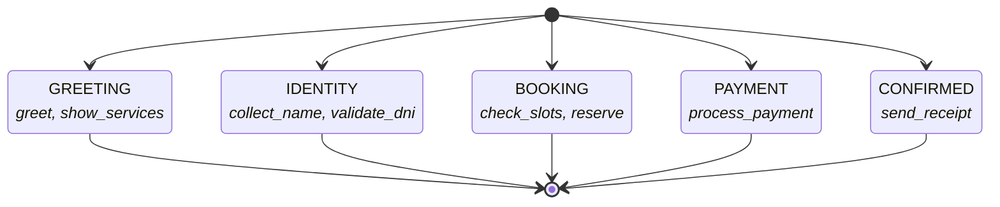

# reactive-fsm

[](https://www.npmjs.com/package/reactive-fsm)
[](https://github.com/roddcode/reactive-fsm/blob/main/LICENSE)

**Deterministic control for AI agents with tool calling.** Define what tools an LLM can call at each step of a conversation. Zero dependencies. TypeScript.



> Generated by `fsm.toMermaid()`. Paste into any README, PR, or Notion.

## What it does

- **Loop shield.** Detects tool-calling loops — configurable threshold, two modes (`consecutive` any-tool or `repeated` same-tool), optional `onLoop` callback with metadata.
- **Async guard.** `guard` accepts `Promise<boolean>`. Use `transitionToAsync()` for DB checks, API calls, or any async validation before state change.
- **State groups.** `STATE:substate` naming convention — `currentStateGroup` returns `'STATE'` for `'STATE:date'`, `'STATE:time'`, `'STATE:confirm'`.
- **5 providers, 1 API.** Vercel AI SDK, OpenAI, Anthropic, LangChain, Google Gemini. Shared adapter base, zero duplication.

## Get started

```bash
pnpm add reactive-fsm
```

```typescript
import { createFSM } from 'reactive-fsm'

const fsm = createFSM({
  initialState: 'IDENTITY',
  states: ['IDENTITY', 'BOOKING', 'PAYMENT'],
  tools: {
    IDENTITY: ['validate_dni'],
    BOOKING: ['check_availability', 'reserve_slot'],
    PAYMENT: ['process_payment'],
  },
  loopShield: { enabled: true, maxConsecutiveTools: 3 },
})

fsm.currentState        // 'IDENTITY'
fsm.allowedTools        // ['validate_dni']

fsm.transitionTo('BOOKING')
fsm.allowedTools        // ['check_availability', 'reserve_slot']
```

### With Vercel AI SDK (3 lines)

```typescript
import { createVercelAdapter } from 'reactive-fsm/adapters/vercel-ai'

const adapter = createVercelAdapter(fsm, registry, context)

const response = await generateText({
  model: openai('gpt-4o'),
  messages,
  ...adapter.inject(),   // { tools, prepareStep }
})
```

### With OpenAI (imperative loop)

```typescript
import { createOpenAIAdapter } from 'reactive-fsm/adapters/openai'

const adapter = createOpenAIAdapter(fsm, registry, context)

while (true) {
  const { tools } = adapter.inject()
  const response = await openai.chat.completions.create({
    model: 'gpt-4o', messages, tools,
    tool_choice: adapter.isLooping() ? 'none' : 'auto',
  })
  if (response.choices[0].message.tool_calls?.length) {
    adapter.registerToolCall()
    continue
  }
  return response.choices[0].message.content
}
```

## Real-world use cases

### Booking funnel

```typescript
const booking = createFSM({
  initialState: 'GREETING',
  states: ['GREETING', 'IDENTITY', 'SCHEDULING', 'CONFIRMED'],
  tools: {
    GREETING:    ['greet', 'show_services'],
    IDENTITY:    ['collect_name', 'collect_contact'],
    SCHEDULING:  ['check_slots', 'reserve_appointment'],
    CONFIRMED:   ['send_confirmation', 'add_to_calendar'],
  },
  prompts: {
    SCHEDULING: 'Offer available slots. Do not ask for identity again.',
  },
  loopShield: { enabled: true, maxConsecutiveTools: 3 },
})
```

In `SCHEDULING`, `collect_name` is gone. The LLM cannot loop back asking for data it already has.

### Payment gate

```typescript
const checkout = createFSM({
  initialState: 'BROWSING',
  states: ['BROWSING', 'CART', 'PAYMENT', 'CONFIRMED'],
  tools: {
    BROWSING:  ['search', 'add_to_cart'],
    CART:      ['view_cart', 'apply_coupon', 'checkout'],
    PAYMENT:   ['process_payment', 'cancel_order'],
    CONFIRMED: ['send_receipt'],
  },
  guard: (from, to) => to === 'PAYMENT' && from !== 'CART' ? false : true,
})
```

In `PAYMENT`: 2 tools. The LLM cannot browse, cannot suggest alternatives, cannot negotiate. The guard blocks jumping from BROWSING straight to PAYMENT.

### Customer support with forced escalation

```typescript
const support = createFSM({
  initialState: 'TRIAGE',
  states: ['TRIAGE', 'DIAGNOSIS', 'SOLUTION', 'ESCALATION'],
  tools: {
    TRIAGE:      ['classify_issue', 'verify_account'],
    DIAGNOSIS:   ['search_kb', 'check_status'],
    SOLUTION:    ['apply_fix', 'send_guide'],
    ESCALATION:  ['transfer_to_human'],
  },
  loopShield: { enabled: true, maxConsecutiveTools: 3 },
})
```

Loop shield triggers after 3 failed fix attempts. `ESCALATION` has exactly one tool. The bot cannot stay in the loop — it must escalate.

## Adapters

| Provider | Import | Loop shield |
|----------|--------|-------------|
| Vercel AI SDK | `reactive-fsm/adapters/vercel-ai` | Automatic via `prepareStep` |
| OpenAI | `reactive-fsm/adapters/openai` | Manual via `isLooping()` |
| Anthropic | `reactive-fsm/adapters/anthropic` | Manual via `isLooping()` |
| LangChain | `reactive-fsm/adapters/langchain` | Manual via `shouldStop()` |
| Google Gemini | `reactive-fsm/adapters/gemini` | Manual via `isLooping()` |

All adapters share the same pattern: build an FSM once, pass it to any adapter, call `inject()` to get provider-formatted tools.

## vs LangGraph

| | reactive-fsm | LangGraph |
|---|---|---|
| Dependencies | 0 (core) | LangChain + sub-dependencies |
| Bundle size | ~7 KB | ~5 MB |
| Define a 3-state FSM | 5 lines | 30+ lines |
| Tool gating per state | Declarative (`tools: { ... }`) | Manual (`route_tools(state)`) |
| Loop shield | Built-in | Not built-in |
| Gate refresh mid-turn | Automatic | Manual |
| Providers | Any (5 adapters) | LangChain ecosystem |

[Full migration guide →](#) _(coming soon)_

## API

```typescript
interface FSMConfig {
  initialState: string
  states: string[]
  tools: Record<string, string[]>
  loopShield?: {
    enabled: boolean
    maxConsecutiveTools: number
    mode?: 'consecutive' | 'repeated'
    fallbackState?: string
    onLoop?: (info: { consecutiveTools: number; maxAllowed: number }) => void
  }
  onTransition?: (from: string, to: string) => void
  guard?: (from: string, to: string, context: Record<string, unknown>) => boolean | Promise<boolean>
  prompts?: Record<string, string>
  snapshot?: { state: string }
  context?: Record<string, unknown>
}

interface FSMPublic {
  currentState: string
  currentStateGroup: string       // 'SCHEDULING' for 'SCHEDULING:date'
  allowedTools: string[]
  isLooping: boolean
  transitionTo(state): void
  transitionToAsync(state): Promise<void>   // for async guard
  snapshot(): { state: string }
  toMermaid(): string
  context: Record<string, unknown>
}
```

```typescript
interface ToolEntry<TContext = any> {
  name: string
  gates: string[]
  condition?: (ctx: TContext) => boolean
  build: (ctx: TContext) => unknown
  schema?: unknown              // Zod/Valibot/ArkType schema
}

buildToolsForGate(gate, ctx, registry): Record<string, unknown>
validateWith(schema, args): { ok, data } | { ok, error }
```

## Architecture

```
src/core/           — zero npm dependencies
  machine.ts        createFSM()
  tool-gating.ts    buildToolsForGate(), validateWith()
  loop-shield.ts    createLoopShield()

src/adapters/       — optional peer dependencies
  vercel-ai.ts      createVercelAdapter()
  openai.ts         createOpenAIAdapter()
  anthropic.ts      createAnthropicAdapter()
  langchain.ts      wrapWithFSM()
  gemini.ts         createGeminiAdapter()
```

MIT · [GitHub](https://github.com/roddcode/reactive-fsm) · [Issues](https://github.com/roddcode/reactive-fsm/issues)
